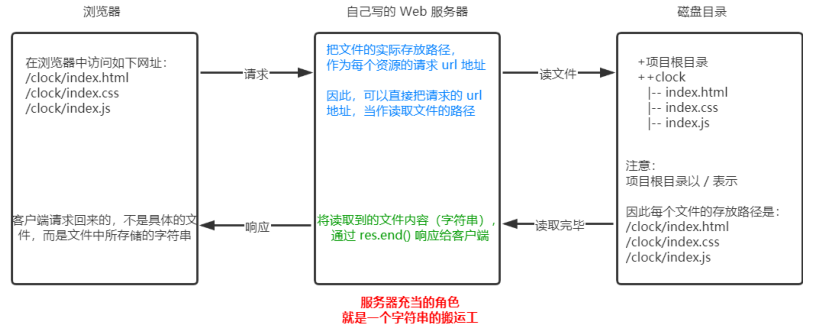
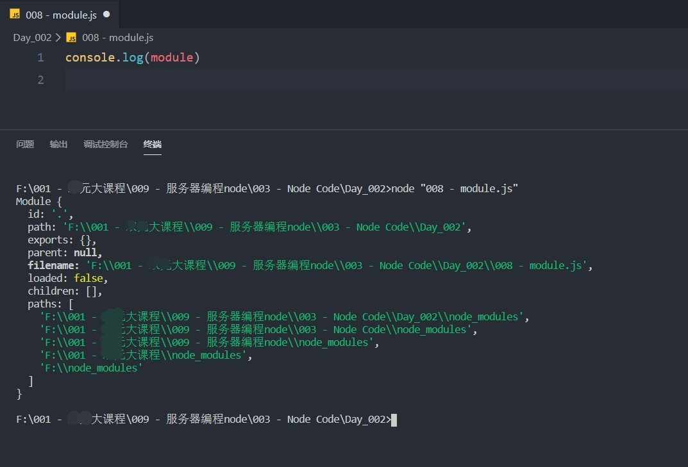
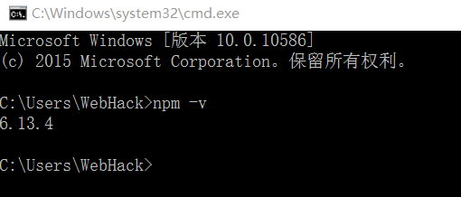

## Node第2天：如何使用node搭建服务器？


### 1.  学习目标

◆  能够使用 `http` 模块写一个基本的 `web` 服务器

◆  能够说出模块化的好处

◆  能够知道 `CommonJS` 规定了哪些内容

◆  能够说出 `Node.js` 中模块的三大分类各自是什么

◆  能够使用 `npm` 管理包


### 2.  `http` 模块

####  2.1  什么是 `http` 模块

> * 什么是客户端？什么是服务器?
> * 什么是http模块?
> * 我们调用什么方法就可以创建一个服务器?
> * 我们如何在代码里面使用http模块?

1.  **网络节点中，消费资源的叫做客户端，负责对外提供网络资源的叫做服务器**
2.  `http` 模块是 `Node.js` 官方提供的、用来创建 `web` 服务器的模块。
3.  通过 `http` 模块提供的 `http.createServer()` 方法，就能方便的把一台普通的电脑，变成一台 `Web` 服务器，从而对外提供 `Web` 资源服务
4.  如果要希望使用 `http` 模块创建 `Web` 服务器，则需要先导入它

```js
const http = require('http');
```


#### 2.2 进一步理解 `http` 模块的作用

> * 服务器和普通电脑的区别是什么？
>
> * nodejs中如何把一个普通电脑变成服务器

1. 服务器和普通电脑的区别在于，服务器上安装了 `web` 服务器软件

   -  例如：`IIS`、`Apache` 等。通过安装这些服务器软件，就能把一台普通的电脑变成一台 web 服务器

     

2.  在 `Node.js` 中，我们不需要使用 `IIS`、`Apache` 等这些第三方 `web` 服务器软件。因为我们可以基于 `Node.js` 提供的 `http` 模块，通过几行简单的代码，就能轻松的手写一个服务器软件，从而对外提供 `web` 服务


### 3.  服务器相关的概念

#### 3.1  `ip` 地址

> * 什么是ip地址？
> * ip地址有什么特点？
> * 我们自己本地电脑的ip地址是多少？

1. `IP 地址`就是互联网上每台计算机的唯一地址，因此 `IP 地址` 具有唯一性
2.  `IP 地址` 的格式：通常用“点分十进制”表示成`(a.b.c.d)`的形式，其中，`a,b,c,d` 都是 0~255 之间的十进制整数
   - 例如：用点分十进表示的 `IP`地址`（192.168.1.1）`


**注意事项**： 

   	1.   **互联网中每台 `Web` 服务器，都有自己的 `IP` 地址**
   	    - 例如：大家可以在 `Windows` 的终端中运行 `ping www.baidu.com` 命令，即可查看到百度服务器的 `IP 地址`
   	        	2.   在开发期间，自己的电脑既是一台服务器，也是一个客户端，为了方便测试，可以在自己的浏览器中输入 `127.0.0.1` 这个 `IP 地址`，就能把自己的电脑当做一台服务器进行访问了


#### 3.2  域名和域名服务器

> * 域名帮我们解决了什么问题？
>
> * 域名和ip地址之间关系？
> * 由谁来保存域名和ip之间的关系的？
> * 如果没有域名我们的电脑是否可以正常工作？

1.  尽管 `IP 地址` 能够唯一地标记网络上的计算机，但 `IP地址` 是一长串数字，不直观，而且不便于记忆，于是人们又发明了另一套字符型的地址方案，即所谓的**域名地址(Domain Name)**

   

2.  `IP地址 `和 `域名` 是一一对应的关系，这份对应关系存放在一种叫做域名服务器 `(DNS，Domain name server)` 的电脑中。使用者只需通过好记的域名访问对应的服务器即可，对应的转换工作由域名服务器实现。因此，**域名服务器就是提供 `IP 地址` 和域名之间的转换服务的服务器**


**注意事项：**

	1.    单纯使用 `IP 地址`，互联网中的电脑也能够正常工作。但是有了域名的加持，能让互联网的世界变得更加方便
	2.    在开发测试期间， `127.0.0.1` 对应的域名是 `localhost`，它们都代表我们自己的这台电脑，在使用效果上没有任何区别


#### 3.3  端口号

> 1. 为什么服务器需要端口号？
> 2. 客户端的请求是如何找到对应的服务的
> 3. 一个端口号能否使用多个web服务

1.  在一台电脑中，可以运行成百上千个 `web 服务`
2.  每个`web 服务` 都对应一个唯一的端口号
3.  客户端发送过来的网络请求，通过端口号，可以被准确地交给对应的 `web 服务` 进行处理


### 4.  创建web服务器

#### 4.1 实现步骤和核心代码

1.   导入 `http 模块`

   ```js
   const http = require('http')
   ```

   

2.  创建 `web` 服务器实例

   ```js
   // 调用 http.createServer() 方法，即可快速创建一个 web 服务器实例
   
   const server = http.createServer()
   ```

   

3.  为服务器实例绑定 `request` 事件

   ```js
   // 为服务器实例绑定 request 事件，即可监听客户端发送过来的网络请求
   
   // 使用服务器实例的 .on() 方法，为服务器绑定一个 request 事件
   server.on('request', (req, res) => {
     // 只要有客户端来请求我们自己的服务器，就会被触发 request 事件，从而调用这个事件处理程序
     console.log('访问服务器成功')
   })
   ```

   

4.  启动服务器

   ```js
   // 调用服务器实例的 .listen() 方法，即可启动当前的 web 服务器实例
   
   server.listen(80, () => {
       console.log('running……')
   })
   ```


#### 4.2  创建基本的服务器

```js
// 1. 导入 http 模块
const http = require('http')

// 2. 创建 web 服务器实例
const server = http.createServer()

// 3. 为服务器实例绑定 request 事件，监听客户端的请求
server.on('request', function (req, res) {
  console.log('访问服务器成功')
})

// 4. 启动服务器
server.listen(8080, function () {  
  console.log('running……')
})

```


#### 4.3  `req` 请求对象

服务器接收到客户端的请求，就会调用通过 `server.on()` 为服务器绑定的 **request 事件处理程序**，如果想在事件处理程序中，访问与客户端相关的数据和属性，可以使用如下方式：

```js
server.on('request', function (req, res) {
  // req 是请求对象，它包含了与客户端相关的数据和属性
  // req.url 获取客户端请求的 url 地址
  // req.method 获取客户端请求的类型

  const str = `${req.url} -- ${req.method}`

  console.log(str)
})
```


#### 4.4  `res` 响应对象

在服务器的 request 事件处理程序中，如果想访问与服务器相关的数据和属性，可以使用如下方式

```js
server.on('request', function (req, res) {
  // res 是响应对象，它包含了与服务器相关的数据和属性
  // 例如：将字符串发送到客户端

  const str = `${req.url} -- ${req.method}`
  
  // res.end() 方法的作用
  // 向客户端发送指定的内容，并结束这次请求的处理过程
  res.end(str)
})
```


#### 4.5  解决中文乱码问题

当调用 `res.end()` 方法，向客户端发送中文内容的时候，会出现乱码问题，此时，需要手动设置内容的编码格式

```js
server.on('request', function (req, res) {
  // 发送包含中文的内容
  const str = `您请求的 url 地址是：${req.url}，请求的 method 类型是：${req.method}`

  // 为了防止中文乱码问题，需要设置响应头，
  res.setHeader('Content-Type', 'text/html; charset=utf-8')

  // 把包含中文的内容返回给客户端
  res.end(str)
})
```


### 5.  根据不同的 `url` 响应不同的内容

#### 5.1  核心实现步骤

1.  获取请求的 `url` 地址
2.  设置默认的响应内容为 `404 Not found`
3.  判断用户请求的是否为 `/` 或 `/index.html` 首页
4.  判断用户请求的是否为 `/about.html` 关于页面
5.  设置 `Content-Type` 响应头，防止中文乱码
6.  使用 `res.end()` 把内容响应给客户端


#### 5.2  动态响应内容

```js
server.on('request', function (req, res) {
  // 1、获取请求的 url 地址
  const url = req.url
  // 2、设置默认的内容为 404 Not Found
  let content = '<h4>404 Not Found</h4>'
  // 3、用户请求的是首页
  if (url === '/' || url === '/index.html') {
    content = '<h4>首页</h4>'
  } else if (url === '/about.html') {
    // 4、用户请求的是关于我们页面
    content = '<h4>关于我们</h4>'
  }

  // 5、设置 Content-Type 响应头，防止中文乱码
  res.setHeader('Content-Type', 'text/html; charset=utf-8')

  // 6、将内容发送给客户端
  res.end(content)
})
```


### 6.  时钟 `web` 服务器案例

#### 6.1  核心思路

把文件的实际存放路径，作为每个资源的请求 `url 地址`



#### 6.2  实现思路

1.  导入需要的模块
2.  创建基本的 `web` 服务器
3.  将资源的请求 `url 地址` 映射为文件的存放路径
4.  读取文件内容并响应给客户端
5.  优化资源的请求路径


#### 6.3  实现步骤

1.  导入需要的模块

   ```js
   // 1.1 导入 http 模块
   const http = require('http')
   // 1.2 导入 fs 文件系统模块
   const fs = require('fs')
   // 1.3 导入 path 路径处理模块
   const path = require('path')
   
   ```

   

2.   创建基本的 web 服务器

   ```js
   // 2.1 创建 web 服务器
   const server = http.createServer()
   
   // 2.2 监听 web 服务器的 request 事件
   server.on('request', (req, res) => {})
   
   // 2.3 启动 web 服务器
   server.listen(80, () => {
     console.log('running……')
   })
   
   ```

   

3.  将资源的请求 `url` 地址映射为文件的存放路径

   ```js
   server.on('request', (req, res) => {
     // 3.1 获取到客户端请求的 url 地址
     const url = req.url
     // 3.2 把请求的 url 地址，映射为本地文件的存放路径
     const fpath = path.join(__dirname, url)
   })
   
   ```

   

4.  根据映射过来的文件路径读取文件

   ```js
   // 4.1 根据映射过来的文件路径读取文件
   fs.readFile(fpath, 'utf8', (err, dataStr) => {
     // 4.2 读取文件失败后，向客户端响应固定的 "错误消息"
     if (err) return res.end('404 Not Fount')
   
     // 4.3 读取文件成功后，将 "读取成功的内容" 响应给客户端
     res.end(dataStr)
   })
   ```

   

5.  优化资源的请求路径

   ```js
   // // 3.2 把请求的 url 地址，映射为本地文件的存放路径
   // const fpath = path.join(__dirname, url)
   
   // 5.1 预定义空白的文件存放路径
   let fpath = ''
   if (url === '/') {
     // 5.2 如果请求的路径是 / ，则手动指定文件的存放路径
     fpath = path.join(__dirname, './clock/index.html')
   } else {
     // 5.3 如果请求的路径不为 / ，则动态拼接文件的存放路径
     fpath = path.join(__dirname, './clock', url)
   }
   ```

   


### 7.  模块化:拆分代码

小霸王，卡带

#### 7.1  什么是模块化

1.  模块化是指解决一个复杂问题时，自顶向下逐层**把系统划分成若干模块的过程**。对于整个系统来说，**模块是可组合、分解和更换的单元**

2.   编程领域中的模块化，就是**遵守固定的规则**，把一个**大文件**拆成**独立并互相依赖的多个小模块**

3.   把代码进行模块化拆分的好处

   -  提高了代码的复用性
   -  提高了代码的可维护性
   -  可以实现按需加载

   

#### 7.2  模块化相关的概念

1.  模块化规范就是对代码进行模块化的拆分与组合时，需要遵守的那些规则，例如：

   - 使用什么样的语法格式来引用模块
   - 在模块中使用什么样的语法格式向外暴露成员

   

2.   模块化规范的好处：大家都遵守同样的模块化规范写代码，降低了沟通的成本，极大方便了各个模块之间的相互调用，利人利己


### 8.  `Node` 中的模块化

#### 8.1  了解 `Node` 中模块的 3 个大类

`Node.js` 中根据模块来源的不同，将模块分为了 3 大类，分别是：

1.  内置模块（内置模块是由 `Node.js` 官方提供的，例如 `fs`、`path`、`http` 等）
2.  自定义模块（用户创建的每个 `.js` 文件，都是自定 义模块）
3.  第三方模块（由第三方开发出来的模块，并非官方提供的内置模块，也不是用户创建的自定义模块，**使用前需要先下载**）


#### 8.2  使用 `require` 方法加载模块

使用强大的 `require()` 方法，可以加载需要的**内置模块**、**用户自定义模块**、**第三方模块**进行使用。例如：

```js
// 1. 加载内置的 fs 模块
const fs = require('fs');

// 2. 加载用户的自定义模块
const custom = require('./custom.js');

// 3. 加载第三方模块，(使用第三方模块，下面会进行讲解)
const moment = require('moment');
```


**注意事项 1： 使用 require() 方法加载其他模块时，会执行被加载模块中的代码**

```js
// 加载模块.js
require('./被加载的模块.js')

```

```js
// 被加载模块.js
console.log('我会被打印')
```


**注意事项2： 在使用 `require` 加载用户自定义模块期间，可以省略 `.js` 后缀名**

```js
// 加载模块.js
require('./被加载的模块')
```


#### 8.3  了解模块作用域的概念以及好处

##### 8.3.1 什么是模块作用域

和函数作用域类似，在自定义模块中定义的变量、方法等成员，只能在当前模块内被访问，外部文件是访问不到的，这种模块级别的访问限制，叫做模块作用域

```js
// 被加载的模块.js

const username = '张三'

function sayHello () {
  console.log('说话')
}
```

```js
// 加载模块.js

const custom = require('./被加载的模块')
```


##### 8.3.2  模块作用域的好处

防止了全局变量污染、文件依赖等问题的产生


#### 8.4   `module` 对象

##### 8.4.1  了解 `module` 对象

在每个 `.js` 自定义模块中都有一个 `module` 对象，它里面存储了和当前模块有关的信息，打印如下：




##### 8.4.2  了解 `module.exports` 对象的作用

1.  在自定义模块中，可以使用 `module.exports` 对象，将模块内的成员共享出去，供外界使用

2.  外界用 `require()` 方法导入自定义模块时，得到的就是 `module.exports` 所指向的对象

   ```js
   // 记载模块.js
   const mo = require('./被加载的模块')
   
   console.log(mo) // {}
   ```

   ```js
   // 被加载的模块.js
   
   // 当外界使用 require 导入一个自定义模块的时候，得到的成员，就是模块中，通过 module.exports 指向的那个对象
   // console.log('我会被加载')
   ```

   

##### 8.4.3  使用 `module.exports` 向外共享成员

```js
// 加载模块.js
const mo = require('./被加载的模块.js')

console.log(mo)
```


```js
// 被加载的模块.js

// 向 module.exports 对象上挂载 username 属性
module.exports.username = 'zs'

// 向 module.exports 对象上挂载 sayHello 方法
module.exports.sayHello = function () {
  console.log('Hellp')
}

```


##### 8.4.4  共享成员时的注意点

使用 `require()` 方法导入模块时，导入的结果，**永远以 `module.exports` 指向的对象为准**

```js
// 加载模块.js
const mo = require('./被加载的模块.js')

console.log(mo) // { username: '小黑', sayHi: [Function: sayHi] }
```


```js
// 被加载模块.js

// 当外界使用 require 导入一个自定义模块的时候，得到的成员，就是模块中，通过 module.exports 指向的那个对象
// console.log(module)

// 向 module.exports 对象上挂载 username 属性
module.exports.username = 'zs'

// 向 module.exports 对象上挂载 sayHello 方法
module.exports.sayHello = function () {
  console.log('Hellp')
}

// 使用 module.exports 指向一个全新的对象
module.exports = {
  username: '小黑',
  sayHi() {
    console.log('小黑')
  }
}

```


#### 8.5  `exports` 对象

由于 `module.exports` 单词写起来比较复杂，为了简化向外共享成员的代码，`Node` 提供了 `exports` 对象。默认情况下，`exports` 和 `module.exports` 指向同一个对象。最终共享的结果，还是以 `module.exports` 指向的对象为准

```js
console.log(exports)

console.log(module.exports)

// 默认情况下，`exports` 和 `module.exports` 指向同一个对象
console.log(exports === module.exports) // true

```

```js
// 将私有成员共享出去
exports.username = 'zs'

// 直接挂载方法
exports.sayHello = function () {
  console.log('Hellp')
}
```


#### 8.6  `exports` 和 `module.exports` 的使用误区

1.   时刻谨记，`require()` 模块时，得到的永远是 `module.exports` 指向的对象
2.  **注意：为了防止混乱，建议大家不要在同一个模块中同时使用 `exports` 和 `module.exports`**

```js
exports.username = 'Tom' // 不会被打印

module.exports = {
  gender: '男',
  age: 22
}
```

```js
module.exports.username = 'Tom'

// 不会被执行
exports = {
  gender: '男',
  age: 22
}

```

```js
// 两个都会执行
module.exports.username = 'Tom'

exports.gender = '男'
```

```js
// 三个都会打印
exports = {
  gender: '男',
  age: 22
}

module.exports = exports;

module.exports.username = 'Tom';

// 
```


#### 8.7  `CommonJS` 模块化规范

1.  `Node.js` 遵循了 `CommonJS` 模块化规范，`CommonJS `规定了**模块的特性和各模块之间如何相互依赖**
2.  `CommonJS` 规定：
   - 每个模块内部，`module` 变量代表当前模块
   - `module` 变量是一个对象，它的 `exports` 属性（即 `module.exports`）是对外的接口
   -  加载某个模块，其实是加载该模块的 `module.exports` 属性。require() 方法用于加载模块


### 9.   包

#### 9.1  什么是包

1.  `Node.js` 中的第三方模块又叫做包


#### 9.2  包的来源

1. 不同于 `Node.js` 中的内置模块与自定义模块，包是由第三方个人或团队开发出来的，免费供所有人使用
2.  注意： `Node.js` 中的包都是免费且开源的，不需要付费即可免费下载使用


#### 9.3  为什么需要包

1.  由于 `Node.js` 的内置模块仅提供了一些底层的 `API`，导致在基于内置模块进行项目开发的时，效率很低 vue react 开发效率高
2.  包是基于内置模块封装出来的，提供了更高级、更方便的 `API`，极大的提高了开发效率
3.  包和内置模块之间的关系，类似于 `jQuery` 和 浏览器内置 `API` 之间的关系


#### 9.4  从哪里下载包

在学习和以后的实际开发中，下载包，都是从 [npm](https://www.npmjs.com/) 这个网站下载


#### 9.5  如何下载包

1.  下载包使用 `npm` ，全名叫做 `Node Package Manager`（简称 `npm` 包管理工具），这个包管理工具随着 `Node.js` 的安装包一起被安装到了用户的电脑上。

2.  可以在终端中执行 `npm -v` 命令，来查看自己电脑上所安装的 `npm` 包管理工具的版本号

   

   
   

### 10.  `npm` 初体验

#### 10.1  格式化时间的传统做法

```js
// 格式化时间方法.js

// 1. 定义格式化时间的方法
function dateFormat(dtStr) {
  const dt = new Date(dtStr)

  const y = dt.getFullYear()
  const m = padZero(dt.getMonth() + 1)
  const d = padZero(dt.getDate())

  const hh = padZero(dt.getHours())
  const mm = padZero(dt.getMinutes())
  const ss = padZero(dt.getSeconds())

  return `${y}-${m}-${d} ${hh}:${mm}:${ss}`
}

// 定义补零的函数
function padZero(n) {
  return n > 9 ? n : '0' + n
}

module.exports = {
  dateFormat
}

```

```js
// 对时间进行格式化.js

// 导入自定义的格式化时间的模块
const TIME = require('./014 - timeformat')

// 调用方法，进行时间的格式化
const dt = new Date()
// console.log(dt)
const newDT = TIME.dateFormat(dt)
console.log(newDT)

```


#### 10.2  使用第三方包对时间进行格式化

##### 10.2.1 实现思路分析

1.  使用 `npm` 包管理工具，在项目中安装格式化时间的包 `moment`

2.  使用 `require()` 导入格式化时间的包

3.  参考 `moment` 的官方 `API` 文档对时间进行格式化

    ```js
    // 1.moment
    const moment = require('moment')
    
    // 2.参考 moment 官方 API 文档，调用对应的方法，对时间进行格式化
    // 2.1 调用 moment() 方法，得到当前的事件
    // 2.2 针对当前的时间，调用 format() 方法，按照指定的格式进行时间的格式化
    const dt = moment().format('YYYY-MM-DD HH:mm:ss')
    
    console.log(dt)
    ```

    


##### 10.2.3   `npm install` 命令安装包

1.  如果想在项目中安装指定名称的包，需要运行如下的命令

   ```js
   npm install 包的完整名称
   ```

   

2.  上述的装包命令，可以简写成如下格式

   ```js
   npm i 包的完整名称
   
   npm i moment
   ```

   

##### 10.2.4  `moment` 对时间格式化

```js
// 1.moment
const moment = require('moment')

// 2.参考 moment 官方 API 文档，调用对应的方法，对时间进行格式化
// 2.1 调用 moment() 方法，得到当前的事件
// 2.2 针对当前的时间，调用 format() 方法，按照指定的格式进行时间的格式化
const dt = moment().format('YYYY-MM-DD HH:mm:ss')

console.log(dt)
```


#### 10.3  `node_modules` 和 `pageage-lock.json` 的作用

初次装包完成后，在项目文件夹下多一个叫做 `node_modules` 的文件夹和 `package-lock.json` 的配置文件，他们的作用是：

1.  `node_modules` 文件夹用来存放所有已安装到项目中的包。`require()` 导入第三方包时，就是从这个目录中查找并加载包
2.  `package-lock.json` 配置文件用来记录 `node_modules` 目录下的每一个包的下载信息，例如包的名字、版本号、下载地址等


#### 10.4  安装指定版本的包

默认情况下，使用 `npm install` 命令安装包的时候，会自动安装最新版本的包。如果需要安装指定版本的包，可以在包名之后，通过 `@ `符号指定具体的版本，例如：

```js
npm i moment@2.22.2
```


#### 10.5  包的语义化版本

`npm` 规定，在项目根目录中，必须提供一个叫做 `package.json` 的包管理配置文件。用来记录与项目有关的一些配置信息。例如：

1.  项目的名称、版本号、描述等
    1.  第一位数字，大版本
    2.  第二位数字，功能版本
    3.  第三数字，bug版本
    4.  只要大版本更新，后面小版本都归零
2.  项目中都用到了哪些包
3.  哪些包只在开发期间会用到
4.  那些包在开发和部署时都需要用到 


