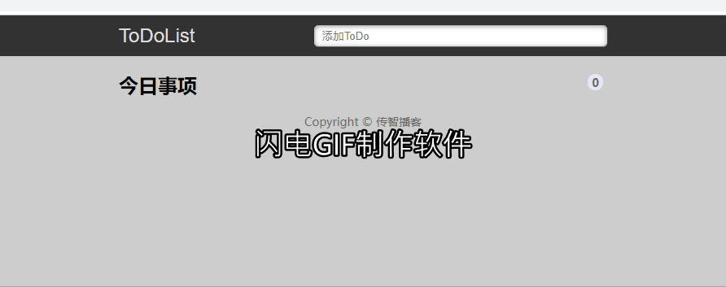

# 代码题参考示例

## 1. 题号：CODE_01

### TODOLIST案例

**训练目标**：强化对jQuery元素操作的练习；

**案例效果**：



**案例素材**：xxxxx

> Tips：素材在作业文件的根目录的 素材文件夹里面；文件的命名以标题二的内容来命名

**试题难度**：

**案例要求**：

1. xxxxxxxx
2. xxxxxxxx
3. ...


**训练提示**：

1. xxxxxxxx
2. xxxxxxxx
3. ...

**参考方案**：xxxxxxxxxxxxx

**操作步骤**：

1. xxxxxxxx
2. xxxxxxxx
3. ...

**参考答案**：

```javascript
// 关键核心的代码以code格式编写，右下方语言选择对应的语言
```

