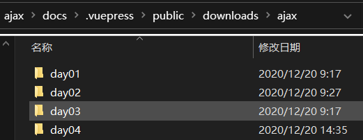
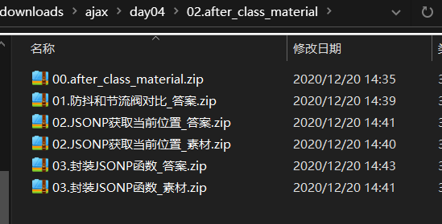
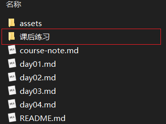

# 教学练测平台出题流程说明文档

## 一、基础环境

### 1.1 git 要求

1. 基于 V7.0 新建**个人**分支，出题内容在个人分支编写，每次提交应该做到有针对性地修改一项内容

2. commit message 编写格式为：`type: subject`

   1. `type` 只允许使用以下 7 个标识：
      1. `feat`: 新功能（feature）
      2. `fix`: 修补 bug
      3. `docs`: 文档（documentation）
      4. `style`: 格式（不影响代码运行的变动）
      5. `refactor`: 重构（即不是新增功能，也不是修改 bug 的代码变动）
      6. `test`: 增加测试
      7. `chore`: 构建过程或辅助工具的变动
   2. `subject` 尽量简短、具体，不超过 50 个字符，并符合以下要求
      1. 以动词开头
      2. 结尾不需要句号

3. 分支合并由项目负责人执行

## 二、出题标准

### 2.1 练习类型 

1. 课堂测试
2. 课后练习

### 2.3 结构规范

1. 题号 + 题目类型结构
2. **题号**统一用**标题二**，格式为： **题目类型编号_序列号**
3. 选择题编号：**choice**
   1. 单选题标号：**SC**（SC代表 single chioce 意思）
   2. 多选题标号：**MC**（MC代表 multiple chioce 意思）
4. 代码题标号：**CODE**
5. 简单题标号：SHQS（SHQS代表 short question 意思）
6. 实操题标号：PO（PO代表Practical Operation 意思）

### 2.3 题目类型结构说明

#### 2.3.1 选择题出题标准

1. 包含维度：训练目标、题目类型、试题难度、题目题干、题目选项、题目答案、试题解析

   1. 训练目标：**精简的词语**描述这个题目考察的知识点，针对的是**单一考点**

   2. 题目类型：**单选题**和**多选题**

   3. 试题难度：试题难度采用五星级别的形式来表现：☆、☆☆、☆☆☆、☆☆☆☆、☆☆☆☆☆。

      其中，☆最容易，☆☆☆☆☆最难

      > Tips：参考 [试题难度说明文档](./02.题目难度说明文档.md)
   
   4. 题目题干：描述应用中文标点符号间隔，代码片段使用英文标点符号
   
   5. 题目选项：有序列表展示，选项后面跟英文`.`，选项与选项内容换行显示；例如：
   
      ```
      1. A.
      XXXXXXXXXXXXXXXX
      2. B.
      XXXXXXXXXXXXXXXX
      ```
      
   6. 题目答案：接在选项后面，格式： 题目答案：XXX
   
   7. 试题解析：知识完整描述，建议复制讲义中内容
   
2. 参考示例：[选择题参考示例](./05.选择题_参考示例.md)


#### 2.3.2 代码题出题标准

1. 包含维度：训练目标，案例效果，试题难度，案例素材，案例要求，训练提示，参考方案，操作步骤，参考答案

   1. 训练目标：运用到哪些知识点

   2. 案例效果：描述要实现的案例效果（最好是图片的方式，如果有交互可以考虑做成gif图）

   3. 试题难度：试题难度采用五星级别的形式来表现：☆、☆☆、☆☆☆、☆☆☆☆、☆☆☆☆☆。

      其中，☆最容易，☆☆☆☆☆最难
   
   4. 案例素材：作业案例的相关素材
   
      > Tips：作业需要让学生练习的是当天的核心代码，结构和需要使用到的第三方需要进行提供
   
   5. 案例要求：需要完成的功能点
   
   6. 训练提示：实现作业案例的关键步骤，可以采取抛问题的方式
   
   7. 参考方案：实现案例的核心思路
   
   8. 操作步骤：实现效果的步骤
   
   9. 参考答案：里面包含关键步骤，以及核心代码
   
3. 出题范围：围绕当天**能力目标**来设计比较综合的案例题目

5. 参考示例：[代码题参考示例](./04.代码题_参考示例.md)

#### 2.3.3 简答题出题标准

1. 包含维度：目标，问题，参考答案
   1. 训练目标：对xxx知识点理解

   2. 试题难度：试题难度采用五星级别的形式来表现：☆、☆☆、☆☆☆、☆☆☆☆、☆☆☆☆☆。
   
      其中，☆最容易，☆☆☆☆☆最难
   
   3. 问题：对题目的描述，需要清晰简明表达出想要提问的知识点
   
   4. 参考答案：针对简答题的答案分析
   
2. 出题范围：

   1. 针对概念型知识点
   2. 最好是常见面试题
   
3. 参考示例：[简答题参考示例](./06.简答题_参考示例.md)

#### 2.3.4 实操题出题标准

1. 包含维度：训练目标，试题难度，训练步骤

   1. 训练目标：对xxx知识点的练习

   2. 试题难度：试题难度采用五星级别的形式来表现：☆、☆☆、☆☆☆、☆☆☆☆、☆☆☆☆☆。

      其中，☆最容易，☆☆☆☆☆最难

   3. 训练步骤：需要练习的步骤罗列出来，标明每个步骤产出的结果

2. 出题范围

   1. 针对Git课程出题

3. 参考示例：[实操题参考示例](./07.实操题_参考示例.md)

### 2.4 出题搭配

咱们练习类型分为了①课堂练习；②课后练习，那么出题的题型在以上4种题型内

#### 2.4.1 课堂练习题目分配

1. 出题比例：最好按照1:10的比例，1个核心知识点对应10道题目

2. 题目类型：单选题，多选题，简答题，代码题

3. 出题维度：围绕课堂上学生应达到的程度来出题

   > Tips：课堂测试题是用来检测学员是否达到课堂上应该达到的水平的，而不是学员最终需要达到的水平

#### 2.4.2 课后练习题目分配

1. 出题比例：每天对应应该有2~3道题目
2. 题目类型：简单题，代码题
3. 出题维度：围绕当天**能力目标**来设计比较综合的案例题目

## 三、操作说明

1. `.vuepress/public/downloads`目录下存放练习素材和参考答案

   1. 每个阶段目录下分为每天目录结构，例如：ajax目录下有 day01，day02，day03，day04 4个子目录

   

   2. 每天目录结构下面分为

      1. `01.class_room_material` 目录，用来存放课堂练习相关素材资料和参考答案
      2. `02.after_class_material` 目录，用来存放课后练习相关素材资料和参考答案
      3. `03.course_material` 目录，用来存放当天课程相关材料
      4. XXX阶段-第几天课程规划.xlsx

      > Tips：练习按照题目进行划分压缩包，方便后续在md文档上进行关联

      

2. 练习的md文件存放在对应阶段讲义目录下,例如：`docs/ajax/`，创建对应文件夹

   

   1. 每天课堂练习&课后作业对应一个md文件，放在对应文件目录下

      1. 命名规整
         - 课程阶段\_classroom\_天数
         - 课程阶段\_afterclass\_天数
      2. 参考示例：
         - Ajax\_classroom\_day01
         - Ajax\_afterclass\_day01

   2. 文档中，一级标题用来说明是练习类型：

      1. 课堂练习示例：课堂练习_ajax-day01
      2. 课后练习示例：课后练习_ajax-day01

   3. 文档中，二级标题格式

      1. 题号：XXX

      2. 示例

         1. 单选题：1. 题号：SC_01
         2. 多选题：2. 题号：MC_01
         3. 代码题：3. 题号：CODE_01
         4. 简答题：4. 题号：SHQS_01

         > Tips：题号前面的序号按自然升序排序

   4. 文档中，在规范里面提到的包含点一律用**加粗**处理

8. 课堂练习和课后练习不需要打成压缩包，后续在每天讲义里面会直接链接到对应的md文档

9. 练习中的素材一律打成压缩包，在文档中标记下载路径


